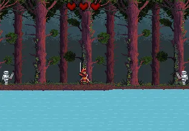

# The Last Samurai

[**▶ Jogar agora**](https://gabs0078.github.io/siteead/)

Jogo 2D de sobrevivência em pixel art desenvolvido no **Construct 3**.

## História

Em um mundo devastado por forças obscuras, o último samurai sobrevive escondido nas florestas. Sua linhagem ancestral carrega um poder especial canalizado pela espada. Hordas de esqueletos caçam sua alma incessantemente — derrote todos para escapar e concluir a jornada... por enquanto.

## Como jogar

- **Mover:** teclas direcionais movem o personagem
- **Atacar:** tecla espaço dispara projéteis de fogo pela espada
- Inimigos aparecem pelos dois lados da tela em ondas
- Sobreviva até eliminar todos para escapar — ou morra tentando

## Sobre o projeto

Desenvolvido como projeto acadêmico na disciplina de desenvolvimento web do curso de Análise e Desenvolvimento de Sistemas. O desafio foi criar o jogo no Construct 3 e entregar o site de apresentação com hospedagem funcional via GitHub Pages.

**Construído com:** Construct 3 · HTML5 · CSS · JavaScript

## Aviso sobre áudios

Os efeitos sonoros utilizados são de fontes externas e foram incluídos exclusivamente para fins acadêmicos, sem fins comerciais.

## Autor

[Gabriel Godoy](https://github.com/Gabs0078) · Estudante de ADS — Centro Universitário Integrado
